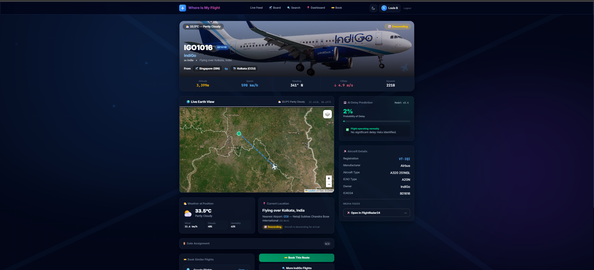
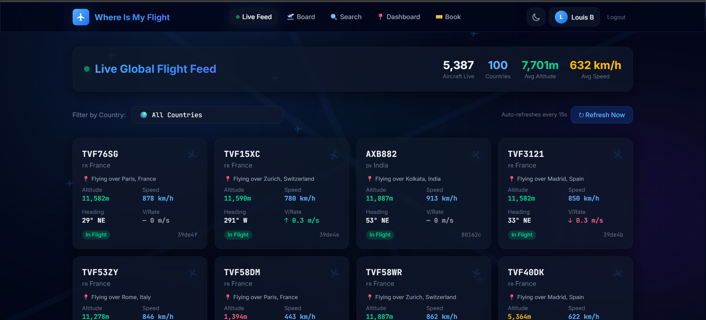
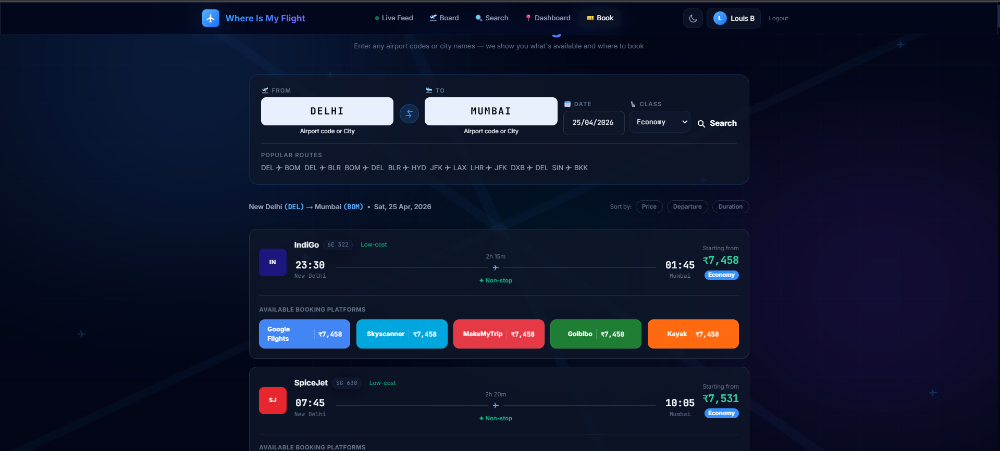
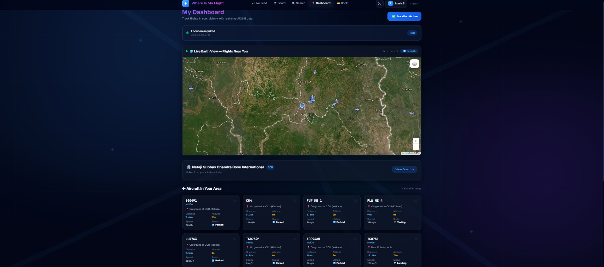

<p align="center">
  <br/>
  <h1 align="center">🛫 Where Is My Flight</h1>
  <p align="center">
    <strong>A high-performance, real-time flight tracking & prediction platform</strong>
  </p>
</p>



"Where Is My Flight" is a modern, polyglot aviation dashboard built for aviation enthusiasts and everyday travelers. It combines live telemetry from global ADS-B networks with a robust machine-learning backend to track flights, predict delays, and provide seamless ticketing integration.

---

## 🌟 Key Features

### 📡 Real-Time Global Tracking
Monitor flights across the globe with our live tracking engine. The system integrates raw telemetry data to display precise aircraft positions, altitudes, speeds, and trajectories over a dynamic, high-fidelity satellite map.



### 🤖 AI-Powered Delay Predictions
We don't just tell you where the plane is—we tell you if it's going to be late. Powered by an **Apache Spark** machine learning pipeline, the platform analyzes historical and real-time weather patterns, routing congestion, and historical airline performance to generate live delay probability models.

### ✈️ Detailed Flight Profiles
Clicking on any flight reveals a gorgeous glassmorphic profile card. It intelligently resolves incomplete ATC callsigns to commercial routes and anchors your flight path from the confirmed origin directly to its destination.

### 🎫 Real-Time Booking Integration
Ready to fly? Our integrated Booking Engine resolves the exact route you're viewing and provides real-time ticketing options, pulling canonical flight prices seamlessly via live integrations.



### 🌐 Community Flight Board
Our live flight board lets users track global departures and arrivals dynamically. As an authenticated user, you can curate a personal Watchlist to get instant updates on flights that matter to you.



---

## 🛠 Technology Stack

Our platform leverages a highly scalable polyglot architecture:

- **Frontend & Web Layer**: Laravel 11 (PHP 8.2), Blade, Vanilla CSS with Glassmorphism, Tailwind CSS, Leaflet.js.
- **Real-Time API & WebSockets**: Play Framework (Scala) for high-concurrency event broadcasting.
- **Machine Learning**: Apache Spark (Scala) running Random Forest classification for flight delay prediction.
- **Data & Caching**: SQLite / PostgreSQL, Redis, Kafka event streams.
- **External APIs**: FlightRadar24 (Raw Telemetry), SerpApi (Google Flights Integration).

---

## 🚀 Getting Started

### Prerequisites
- PHP 8.2+ and Composer
- Node.js and NPM
- Scala and sbt (for the Play/Spark backend)
- Java 11 or 17

### Installation

1. **Clone the repository:**
   ```bash
   git clone https://github.com/Cenizas036/where-is-my-flight.git
   cd where-is-my-flight/web
   ```

2. **Install PHP and Node dependencies:**
   ```bash
   composer install
   npm install
   ```

3. **Configure the environment:**
   ```bash
   cp .env.example .env
   php artisan key:generate
   ```
   *Make sure to add your `SERPAPI_KEY` to the `.env` file for live booking data.*

4. **Run migrations and seed the database:**
   ```bash
   php artisan migrate:fresh --seed
   ```

5. **Start the local development servers:**
   ```bash
   # Terminal 1 (Vite Assets)
   npm run dev

   # Terminal 2 (Laravel Backend)
   php artisan serve
   ```

6. **Start the Prediction/Event APIs (Optional):**
   ```bash
   cd ../api
   sbt run
   ```

---

## 💡 Architecture Notes
- The Laravel application manages the user experience, authentication, and the primary API Gateway.
- A secondary Play Framework layer consumes Kafka topics for massive real-time ADS-B updates, streaming them to the client via WebSockets.
- Flight route fallback ensures that even private or ATC-tracked flights display accurate origin/destination details or dynamically project forward trajectories on the map.

---
Hosted at: [Where Is My Flight](https://where-is-my-flight-production.up.railway.app/)

*Built with ❤️ for aviation geeks and travelers everywhere.*
